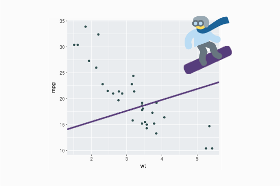
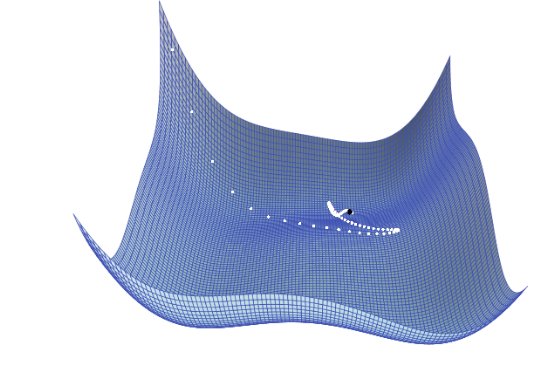
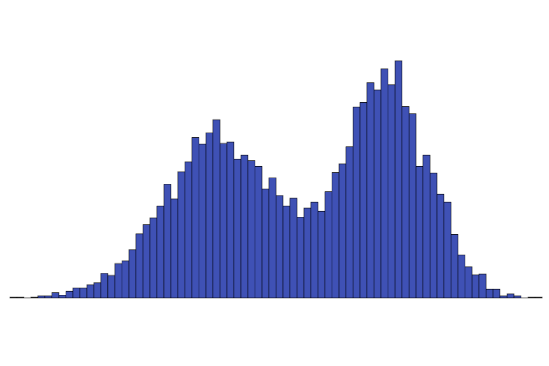

# R Shiny Apps

## 1. Getting to the Bottom

An educational app to visualize how Gradient Descent is working.  

Check on Shinyapps.io:
[Linear Regression with Gradient Descent](https://kocabiyik.shinyapps.io/gradient-descent/).



Run locally:
```
shiny::runGitHub(repo = 'kocabiyik/shiny-apps', subdir = 'gradient-descent')
```

## 2. Gradient Descent with Momentum

What happens if it gains momentum?  

Check on Shinyapps.io:
[Gradient Descent with Momentum](https://kocabiyik.shinyapps.io/gradient-descent-with-momentum/).

  

Run locally:
```
shiny::runGitHub(repo = 'kocabiyik/shiny-apps', subdir = 'gradient-descent-with-momentum')
```

## 3. Central Limit Theorem - A Simulation

Understanding Central Limit Theorem   



Check on Shinyapps.io:
[Central Limit Theorem](https://kocabiyik.shinyapps.io/central-limit-theorem/).

Run locally:
```
shiny::runGitHub(repo = 'kocabiyik/shiny-apps', subdir = 'central-limit-theorem')
```
